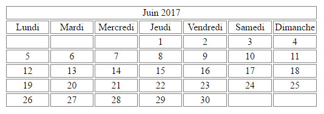

# learning PHP

*created by A. Mondt*
 
*last update March 2019*

## Description

Exercices using PHP

### Requirements

- XAMPP | WAMP | LAMP | MAMP installed

Ubuntu installation e.g.

    sudo apt update
    sudo apt install apache2 php libapache2-mod-php mysql-server php-mysql
    sudo apt install php-curl php-gd php-intl php-json php-mbstring php-xml php-zip

### Instructions

- Open a terminal at the root of the 'learn-php' folder
- Run a php server here, e.g.:

        php -S localhost:8080
- Open a new tab in your browser and type in the URL:

        localhost:8080/the_exercice_file.php | e.g. localhost:8080/calculator/calculator.php

## Exercices

### Summary

- [Les variables](#variables)
- [Les conditions](#conditions)
- [Les boucles](#boucles)
- [Les fonctions](#fonctions)
- [Les tableaux](#tableaux)
- [Les paramètres](#parametres)
- [Les formulaires](#formulaires)
- [Les variables globales](#superGlobales)
- [Les dates](#dates)
- [TP: calculatrice en PHP](#calculatrice)

### Variables

#### Exercice 1

1. Créer trois variables `nom`, `prenom` et `age` et les initialiser avec les valeurs de votre choix.
2. Attention `age` est de type entier.
3. Afficher leur contenu de sorte qu'on puisse lire sur le navigateur "Bonjour `prenom`, enfant de la famille `nom` ayant atteint de level `age` !". 

#### Exercice 2

1. Créer une variable `km`. L'initialiser à 1. Afficher son contenu.
2. Changer sa valeur par 3. Afficher son contenu.
3. Changer sa valeur par 125. Afficher son contenu.

#### Exercice 3

1. Créer une variable de type string, une variable de type int, une variable de type float, une variable de type booléan et les initialiser avec une valeur de votre choix.
2. Les afficher.

#### Exercice 4

1. Créer une variable de type int.
2. L'initialiser avec rien.
3. Afficher sa valeur.
4. Donner une valeur à cette variable et l'afficher.

#### Exercice 5

1. Créer 3 variables.
2. Dans la première mettre le résultat de l'opération 3 + 4.
3. Dans la deuxième mettre le résultat de l'opération 5 * 20.
4. Dans la troisième mettre le résultat de l'opération 45 / 5.
5. Afficher le contenu des variables.

#### Exercice 6

1. C'est les soldes. Un t-shirt qui te plaît coûte 785€ à la base mais ce mois-ci, ton magasin préféré lui applique une ristourne de 30%. Grâce à tes nouvelles connaissances en PHP, affiche le prix de départ, le montant de la ristourne et le prix que tu vas payer sur ton navigateur.

### Conditions

#### Exercice 1

Créer une variable `age` et l'initialiser avec une valeur.  
Si l'âge est supérieur ou égale à 18, afficher **Vous êtes majeur**.
Dans le cas contraire, afficher **Vous êtes mineur**.

#### Exercice 2

Créer une variable `IsEasy` de type booléan et l'initialiser avec une valeur.  

Afficher **C'est facile!!** si c'est vrai. Dans le cas contraire afficher **C'est difficile !!!**.  

**Bonus :** L'écrire de deux manières différentes.

#### Exercice 3

Créer deux variables `age` et `genre`. La variable `genre` peut prendre comme valeur :

- Homme
- Femme  

En fonction de l'âge et du genre, afficher la phrase correspondante :

- Vous êtes un homme et vous êtes majeur
- Vous êtes un homme et vous êtes mineur
- Vous êtes une femme et vous êtes majeur
- Vous êtes une femme et vous êtes mineur

Gérer tous les cas.

#### Exercice 4

L'échelle de Richter est un outil de mesure qui permet de définir la magnitude de moment d'un tremblement de terre. Cette échelle va de 1 à 9.  

Créer une variable `magnitude`. Selon la valeur de `magnitude`, afficher la phrase correspondante.
Indice : *Utiliser autre chose que des if else, comme par exemple, un switch*

Magnitude | Phrase
--------- | ------
1         | Micro-séisme impossible à ressentir.
2         | Micro-séisme impossible à ressentir mais enregistrable par les sismomètres.
3         | Ne cause pas de dégats mais commence à pouvoir être légèrement ressenti.
4         | Séisme capable de faire bouger des objets mais ne causant généralement pas de dégats.
5         | Séisme capable d'engendrer des dégats importants sur de vieux bâtiments ou bien des bâtiments présentants des défauts de construction. Peu de dégats sur des bâtiments modernes.
6         | Fort séisme capable d'engendrer des destructions majeures sur une large distance (180 km) autour de l'épicentre.
7         | Séisme capable de destructions majeures à modérées sur une très large zone en fonction de la distance.
8         | Séisme capable de destructions majeures sur une très large zone de plusieurs centaines de kilomètres.
9         | Séisme capable de tout détruire sur une très vaste zone.

Gérer tous les cas.  

#### Exercice 5

Traduire ce code avec des if et des else :  

    <?php
      echo ($maVariable != 'Homme') ? 'C\'est une développeuse !!!' : 'C\'est un développeur !!!';
    ?>

#### Exercice 6

Traduire ce code avec des if et des else :  

    <?php
      echo ($monAge >= 18) ? 'Tu es majeur' : 'Tu n\'es pas majeur';
    ?>

#### Exercice 7

Traduire ce code avec des if et des else :  

    <?php
      echo ($maVariable == false) ? 'c\'est pas bon !!!' : 'c\'est ok !!';
    ?>

#### Exercice 8

Traduire ce code avec des if et des else :  

    <?php
      echo ($maVariable) ? 'c\'est ok !!' : 'c\'est pas bon !!!';
    ?>

### Boucles

#### Exercice 1

Créer une variable et l'initialiser à 0.
Tant que cette variable n'atteint pas 10, il faut :

- l'afficher
- l'incrementer

#### Exercice 2

Créer deux variables. Initialiser la première à 0 et la deuxième avec un nombre compris en 1 et 100.
Tant que la première variable n'est pas supérieur à 20 :

- multiplier la première variable avec la deuxième
- afficher le résultat
- incrementer la première variable

#### Exercice 3

Créer deux variables. Initialiser la première à 100 et la deuxième avec un nombre compris en 1 et 100.
Tant que la première variable n'est pas inférieure ou égale à 10 :

- multiplier la première variable avec la deuxième
- afficher le résultat
- décrémenter la première variable

#### Exercice 4

Créer une variable et l'initialiser à 1.
Tant que cette variable n'atteint pas 10, il faut :

- l'afficher
- l'incrementer de la moitié de sa valeur

#### Exercice 5

En allant de 1 à 15 avec un pas de 1, afficher le message **On y arrive presque**.
Combien de fois le message s'affiche-il ?

#### Exercice 6

En allant de 20 à 0 avec un pas de 1, afficher le message **C'est presque bon**. Combien de fois le message s'affiche-il ?

#### Exercice 7

En allant de 1 à 100 avec un pas de 15, afficher le message **On tient le bon bout**. Combien de fois le message s'affiche-il ?

#### Exercice 8

En allant de 200 à 0 avec un pas de 12, afficher le message **Enfin !!!!**. Combien de fois le message s'affiche-il ?

### Fonctions

#### Exercice 1

Faire une fonction qui retourne `true`.

#### Exercice 2

Faire une fonction qui prend en paramètre une chaine de caractères et qui retourne cette même chaine.

#### Exercice 3

Faire une fonction qui prend en paramètre deux chaines de caractères (prénom et nom de famille) et qui retourne la concaténation de ces deux chaines.

#### Exercice 4

Faire une fonction qui prend en paramètre deux nombres. La fonction doit retourner :

- **Le premier nombre est plus grand** si le premier nombre est plus grand que le deuxième
- **Le premier nombre est plus petit** si le premier nombre est plus petit que le deuxième
- **Les deux nombres sont identiques** si les deux nombres sont égaux

#### Exercice 5

Faire une fonction qui prend en paramètre un nombre et une chaine de caractères et qui retourne la concaténation de ces deux paramètres.

#### Exercice 6

Faire une fonction qui prend trois paramètres : **nom**, **prenom** et **age**. Elle doit retourner une chaine de la forme :
"Bonjour" + **nom** + **prenom** + ",tu as" + **age** + "ans".

#### Exercice 7

Faire une fonction qui prend deux paramètres : **age** et **genre**. Le paramètre **genre** peut prendre comme valeur :

- Homme
- Femme

La fonction doit renvoyer en fonction des paramètres :

- **Vous êtes un homme et vous êtes majeur**
- **Vous êtes un homme et vous êtes mineur**
- **Vous êtes une femme et vous êtes majeur**
- **Vous êtes une femme et vous êtes mineur**

Gérer tous les cas.

#### Exercice 8

Faire une fonction qui prend en paramètre trois nombres et qui retourne la somme de ces nombres.
Tous les paramètres doivent avoir une valeur par défaut.

### Tableaux

#### Exercice 1

Créer un tableau `mois` et l'initialiser avec les valeurs suivantes :

- **janvier**
- **février**
- **mars**
- **avril**
- **mai**
- **juin**
- **juillet**
- **aout**
- **septembre**
- **octobre**
- **novembre**
- **décembre**

#### Exercice 2

Avec le tableau de l'exercice 1,

1. afficher la valeur de la troisième ligne de ce tableau.
2. afficher la valeur de l'index 5.
3. modifier le mois de **aout** pour lui ajouter l'accent manquant.

#### Exercice 3

Voici la liste des départements de la région Auvergne-Rhône-Alpes :
Ain (01), Allier (03), Ardèche (07), Cantal (15), Drôme (26), Isère (38), Loire (42), Haute-Loire (43), Puy-de-Dôme (63), Rhône (69), Savoie (73), Haute-Savoie (74)

1. Créer un tableau associatif avec comme index le numéro des départements et en valeur leur nom.
2. Afficher la valeur de l'index 69.
3. Ajouter la ligne correspondant au département de la ville de Metz.
4. Afficher toutes les valeurs ainsi que les clés associées grâce à une boucle sous la forme : **"Le département" + nom_departement + "a le numéro" + num_departement**

#### Exercice 4 - Les feux de l'amour

Camille se marie et doit envoyer des mails à ses amis.

En utilisant ce tableau, faites en sorte que chaque personne de cette liste reçoit le même mail en faisant en sorte qu'il soit personnalisé.

``array("Alex", "Max", "Dominique", "Claude", "Leslie", "Charlie", "Lou");``

Mail : "Salut `prénom`, devine quoi ! Je me marie dans samedi dans deux semaines ! J'espère te compter parmi les invités ! Gros bisous :)"

### Parametres

#### Exercice 1

Faire une page index.php. Tester sur cette page que tous les paramètres de cette URL existent et les afficher: **index.php?nom=Nemare&prenom=Jean**

#### Exercice 2

Faire une page index.php. Tester sur cette page que le paramètre **age** existe et si c'est le cas l'afficher sinon le signaler : **index.php?nom=Nemare&prenom=Jean**

#### Exercice 3

Faire une page index.php. Tester sur cette page que tous les paramètres de cette URL existent  et les afficher: **index.php?dateDebut=2/05/2016&dateFin=27/11/2016**

#### Exercice 4

Faire une page index.php. Tester sur cette page que tous les paramètres de cette URL existent  et les afficher: **index.php?langage=PHP&serveur=LAMP**

#### Exercice 5

Faire une page index.php. Tester sur cette page que tous les paramètres de cette URL existent  et les afficher: **index.php?semaine=12**

#### Exercice 6

Faire une page index.php. Tester sur cette page que tous les paramètres de cette URL existent  et les afficher: **index.php?batiment=12&salle=101**

### Formulaires

#### Exercice 1

Créer un formulaire demandant **le nom** et **le prénom**. Ce formulaire doit rediriger vers la page **user.php** avec la méthode **GET**.

#### Exercice 2

Créer un formulaire demandant **le nom** et **le prénom**. Ce formulaire doit rediriger vers la page **user.php** avec la méthode **POST**.

#### Exercice 3

Avec le formulaire de l'exercice 1, afficher dans la page user.php les données du formulaire transmis.

#### Exercice 4

Avec le formulaire de l'exercice 2, afficher dans la page user.php les données du formulaire transmises.

#### Exercice 5

Créer un formulaire sur la page **index.php** avec :

- Une liste déroulante pour la civilité (Mr ou Mme)
- Un champ texte pour le nom
- Un champ texte pour le prénom

Ce formulaire doit rediriger vers la page **index.php**.
Vous avez le choix de la méthode.

#### Exercice 6

Avec le formulaire de l'exercice 5, si des données sont passées en **POST** ou en **GET**, le formulaire ne doit plus être affiché. Par contre les données transmises doivent l'être. Si aucune donnée ne sont passées en **POST** ou **GET**, le formulaire reste visible.
Utiliser qu'une seule page.

#### Exercice 7

Au formulaire de l'exercice 5, ajouter un champ d'envoi de fichier. Afficher, en plus de ce qui est demandé à l'exercice 6, le nom et l'extension du fichier.

#### Exercice 8

Sur le formulaire de l'exercice 6, en plus de ce qui est demandé sur les exercices précédents, vérifier que le fichier transmis est bien un fichier **pdf**.

### Super Gloables

#### Exercice 1

Faire une page HTML permettant de donner à l'utilisateur :

- son User Agent
- son adresse ip
- le nom du serveur

#### Exercice 2

Sur la page index, faire un lien vers une autre page. Passer d'une page à l'autre le contenu des variables `nom`, `prenom` et `age` grâce aux sessions. Ces variables auront été définies directement dans le code.
Il faudra afficher le contenu de ces variables sur la deuxième page.

#### Exercice 3

Faire un formulaire qui permet de récupérer le login et le mot de passe de l'utilisateur. A la validation du formulaire, stocker les informations dans un cookie.

#### Exercice 4

Faire une page qui va récupérer les informations du cookie créé à l'exercice 3 et qui les affiche.

#### Exercice 5

Faire une page qui va pouvoir modifier le contenu du cookie de l'exercice 3.

### Dates

#### Exercice 1

Afficher la date courante en respectant la forme **jj/mm/aaaa** *(ex : 23/06/2017)*

#### Exercice 2

Afficher la date courante en respectant la forme **jj-mm-aa** *(ex : 23-06-17)*

#### Exercice 3

Afficher la date courante avec le jour de la semaine et le mois en toutes lettres *(ex : mardi 2 août 2016)*

**Bonus** : Le faire en français.

#### Exercice 4

Afficher le timestamp du jour.
Afficher le timestamp du mardi 2 août 2016 à 15h00.

#### Exercice 5

Afficher le nombre de jour qui sépare la date du jour avec le 16 mai 2016.

#### Exercice 6

Afficher le nombre de jour dans le mois de février de l'année 2017.

#### Exercice 7

Afficher la date du jour + 20 jours.

#### Exercice 8

Afficher la date du jour - 22 jours

#### TP

Faire un formulaire avec deux listes déroulantes. La première sert à choisir le mois, et le deuxième permet d'avoir l'année.
En fonction des choix, afficher un calendrier comme celui-ci :

